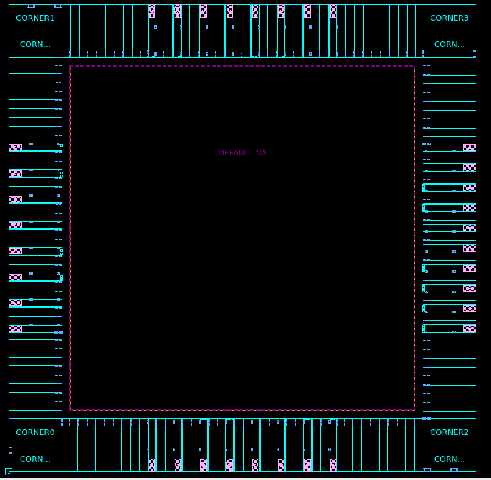

# Projeto RISC-V RVX - Entrega 2

## Identificação

- **Grupo:** grupo_4
- **Integrantes:** Cristofer Farenzena Sanhudo, Gabriel Machado Dick e Matheus Almeida Silva
- **Projeto:** RVX (RISC-V)
- **Tecnologia:** SAED 32 nm
- **Ferramenta:** Synopsys Fusion Compiler
- **Data:** 06/08/2026

## 1. Objetivo

O objetivo desta entrega foi realizar a síntese lógica do processador RISC-V RVX e iniciar sua implementação física até o floorplan. O fluxo de referência disponibilizado para ICC2 foi adaptado ao Fusion Compiler, incluindo as bibliotecas de células padrão e de I/O, a intenção de potência, as restrições temporais, a configuração MCMM e o anel de pads.

A compilação foi limitada ao estágio:

```tcl
compile_fusion -to initial_map
```

Assim, o placement das células internas, a síntese da árvore de clock (CTS), o routing e as otimizações físicas finais não fazem parte desta entrega.

## 2. Síntese lógica

O módulo de topo utilizado foi `top_pad_rvx`. Após a leitura e elaboração do RTL, a netlist foi mapeada para as bibliotecas SAED32. O relatório de consistência do RTL não apresentou divergências, e não foram inferidas macros ou black boxes.

Foram gerados como saída a netlist mapeada `output/rvx_mapped.v` e o arquivo de restrições `output/rvx_entrega2.sdc`.

### 2.1 Frequência-alvo e restrições

O clock `RVX_CLK` foi criado na porta `clock` com período de 30 ns. A frequência-alvo correspondente é:

$$
f = \frac{1}{30\ \text{ns}} = 33{,}33\ \text{MHz}
$$

| Parâmetro | Valor |
|---|---:|
| Período do clock | 30 ns |
| Frequência-alvo | 33,33 MHz |
| Incerteza de setup | 1 ns |
| Latência do clock | 1 ns |
| Transição do clock | 0,2 ns |
| Atraso máximo das entradas e saídas | 0,1 ns |
| Atraso mínimo das entradas e saídas | 0,1 ns |
| Transição das entradas | 0,2 ns |
| Carga das saídas | 10,0 unidades da biblioteca |

Os atrasos máximos foram aplicados ao cenário de setup e os atrasos mínimos ao cenário de hold. O `check_timing.rpt` apresentou zero erros e zero avisos nos dois cenários, confirmando que as restrições foram carregadas de forma consistente. Essa verificação avalia a configuração da análise; o fechamento dos slacks é apresentado separadamente na Seção 5.2.

## 3. Configuração MCMM

Foi criado o modo `functional` com dois cenários ativos: um corner lento para setup e um corner rápido para hold.

| Cenário | Corner | Condição | Processo | VDD | VDDIO | Temperatura | Parasitas | Análise |
|---|---|---|---:|---:|---:|---:|---|---|
| `functional_ss` | `corner_ss` | `ss0p95v125c` | 0,99 | 0,95 V | 2,25 V | 125 °C | `maxTLU` | Setup |
| `functional_ff` | `corner_ff` | `ff1p16vn40c` | 1,01 | 1,16 V | 2,75 V | -40 °C | `minTLU` | Hold |

O cenário `functional_ss` combina processo lento, alta temperatura e parasitas máximos, representando a condição conservadora para setup. O cenário `functional_ff` combina processo rápido, baixa temperatura e parasitas mínimos, sendo utilizado para a verificação de hold.

As bibliotecas NDM foram verificadas antes da seleção dos PVTs. O `pvt.rpt` confirmou, para `corner_ss` e `corner_ff`, que não existem incompatibilidades entre as condições especificadas e os panes efetivamente selecionados:

```text
Information: Corner corner_ss: no PVT mismatches. (PVT-032)
Information: Corner corner_ff: no PVT mismatches. (PVT-032)
```

Portanto, os resultados desta entrega utilizam combinações PVT existentes simultaneamente nas bibliotecas de células padrão, células de alimentação, level shifters e pads.

## 4. Floorplan e anel de I/O

O floorplan foi definido com formato quadrado. Suas dimensões foram determinadas principalmente pela profundidade dos pads e pelo espaço necessário entre o anel de I/O e o core.

| Parâmetro | Valor |
|---|---:|
| Die | 1950 x 1950 µm |
| Core | 1250 x 1250 µm |
| Core offset | 350 µm |
| Pads de sinal | 18 |
| Pads de alimentação | 16 |
| Células de corner | 4 |

O offset de 350 µm acomoda os aproximadamente 300 µm de profundidade dos pads e preserva uma margem adicional de 50 µm. Fillers foram inseridos para fechar os espaços restantes nas quatro bordas.



**Figura 1 -** Floorplan do RVX com die, core e anel de I/O.

A região central permanece sem células posicionadas porque o fluxo foi encerrado em `initial_map`, antes do placement. As verificações do anel de I/O não encontraram overlaps, gaps ou violações das restrições de sinais.

### 4.1 Utilização

O `report_utilization` exclui as células de I/O do cálculo de ocupação das site rows.

| Resultado | Valor |
|---|---:|
| Área disponível para placement | 3.801.345,66 µm² |
| Área de células considerada na utilização | 56.387,44 µm² |
| Utilização | 1,48% |
| Área de objetos excluídos, principalmente I/O | 2.820.000,00 µm² |

A baixa utilização decorre do dimensionamento do die pelo anel de pads e da ausência de placement. A área considerada neste cálculo não deve ser confundida com a área total da netlist, pois as células de I/O são excluídas pelo comando.

## 5. Resultados obtidos

### 5.1 Área pós-síntese

| Resultado | Valor |
|---|---:|
| Número total de células | 12.920 |
| Células combinacionais | 9.279 |
| Células sequenciais | 3.641 |
| Buffers/inversores | 731 |
| Área combinacional | 241.355,44 µm² |
| Área não combinacional | 31.032,00 µm² |
| Área total de células | 272.387,44 µm² |

Não foram identificadas macros ou black boxes. A diferença entre a área total desta tabela e a área utilizada no cálculo de ocupação decorre da exclusão das células de I/O pelo `report_utilization`.

### 5.2 Timing pós-síntese

| Análise | Cenário | Pior slack | TNS/violação total | Caminhos violados | Situação |
|---|---|---:|---:|---:|---|
| Setup | `functional_ss` | +13,18 ns | 0,00 ns | 0 | Atendido |
| Hold | `functional_ff` | -0,01 ns | -0,01 ns | 1 | Não atendido |

O pior caminho de setup inicia em `gpio_output_enable_reg[0]`, termina em `read_data_reg[0]` e atravessa a lógica associada ao GPIO e ao pad `PAD_GPIO_0`. A chegada dos dados ocorreu em 16,64 ns, enquanto o tempo requerido foi 29,82 ns, resultando em slack positivo de 13,18 ns. Portanto, o requisito de setup para a frequência-alvo de 33,33 MHz foi atendido no estágio `initial_map`.

O único caminho com violação de hold inicia em `spi_state_reg[0]` e termina no pino de habilitação da célula de clock gating `cycle_counter_reg`. A chegada dos dados ocorreu em 0,05 ns, enquanto a verificação da biblioteca exigiu 0,06 ns. A diferença resultou em slack de -0,01 ns, equivalente a aproximadamente 10 ps.

Essa violação não foi ocultada nem eliminada por relaxamento do corner FF. Como ainda não houve placement, CTS ou otimização física de hold, o caminho deverá ser tratado nas próximas etapas do fluxo, normalmente por inserção de atraso e otimização da rede. Assim, a frequência-alvo foi atendida em setup, mas o projeto ainda não apresenta fechamento completo de timing por causa dessa única violação de hold.

## 6. Verificações complementares

| Verificação | Resultado |
|---|---|
| Consistência PVT | Nenhuma incompatibilidade nos corners SS e FF |
| Cobertura/configuração de timing | 0 erros e 0 avisos nos dois cenários |
| Consistência da leitura do RTL | Nenhuma divergência |
| Setup em `functional_ss` | +13,18 ns; sem caminhos violados |
| Hold em `functional_ff` | -0,01 ns; 1 caminho violado |
| Anel de I/O | Sem overlaps, gaps ou violações de sinais |
| Verificação multivoltagem | 0 erros e 2 avisos de tie-off não implementado |
| Regras elétricas | 323 violações de transição e 483 de capacitância em 605 redes |

Os dois avisos multivoltagem (`MV-027`) indicam que as conexões de tie-off lógico 0 e lógico 1 ainda não foram implementadas. Não foram encontrados erros nas regras de domínios, redes de alimentação, isolamento ou deslocamento de nível.

O `qor.rpt` também registrou violações de transição máxima e capacitância máxima. Esses resultados foram obtidos logo após `initial_map`, antes das etapas de posicionamento e otimização física responsáveis por dimensionamento de células, inserção de buffers, fanout e redução de capacitâncias. Como uma mesma rede pode violar mais de uma regra, o total de 605 redes não corresponde à soma direta das duas categorias.

Foi emitido ainda o aviso `DPPA-325` para algumas portas lógicas de topo sem formas físicas de pino. Esse aviso não impediu a criação do floorplan nem do anel de pads, cujas verificações específicas foram concluídas sem violações.

## 7. Adaptações realizadas

O fluxo de referência foi reorganizado para execução no Fusion Compiler. As principais adaptações foram:

- criação da biblioteca de trabalho e carregamento das Fusion Libraries locais;
- configuração dos modelos parasíticos TLU+ máximo e mínimo;
- carregamento e verificação da intenção de potência em UPF;
- criação de cenários separados para setup e hold;
- seleção de panes PVT existentes em todas as bibliotecas de referência;
- aplicação dos atrasos máximos em `functional_ss` e dos atrasos mínimos em `functional_ff`;
- criação e verificação automática do anel de I/O;
- exportação da netlist mapeada e das restrições;
- geração automática dos reports da entrega.

Uma execução iniciada com a biblioteca de trabalho vazia percorreu todos os scripts até a mensagem final do fluxo. Isso confirma que a configuração utilizada nos reports foi reproduzida pelos arquivos da entrega, sem depender de comandos manuais deixados em uma sessão anterior.

## 8. Conclusão

A síntese lógica do RVX foi concluída para a tecnologia SAED 32 nm, e o floorplan quadrado de 1950 x 1950 µm foi criado com o anel completo de I/O. A configuração MCMM utiliza panes compatíveis com todas as bibliotecas e foi validada sem incompatibilidades PVT.

O projeto resultou em 12.920 células, área total de 272.387,44 µm² e utilização de 1,48% quando excluídas as células de I/O. O requisito de setup para 33,33 MHz foi atendido com margem de 13,18 ns. A análise de hold identificou uma única violação de 0,01 ns em um caminho de clock gating do SPI, a ser corrigida durante as próximas etapas de implementação física.

Portanto, os objetivos previstos para a Entrega 2 - síntese lógica, configuração MCMM, criação do floorplan e documentação dos resultados pós-`initial_map` - foram atingidos. O resultado não deve ser interpretado como timing fechado ou signoff, pois placement, CTS, routing e otimizações finais ainda não foram executados.

## 9. Arquivos da entrega

- `relatorio.md`;
- pasta `scripts/` com os scripts utilizados até o floorplan e `initial_map`;
- `reports/area.rpt`;
- `reports/timing_setup_ss.rpt`;
- `reports/timing_hold_ff.rpt`;
- `reports/utilization.rpt`;
- `reports/check_timing.rpt`;
- `reports/qor.rpt`;
- `reports/mcmm.rpt`;
- `reports/pvt.rpt`;
- `output/rvx_mapped.v`;
- `output/rvx_entrega2.sdc`;
- `prints/floorplan.png`.
